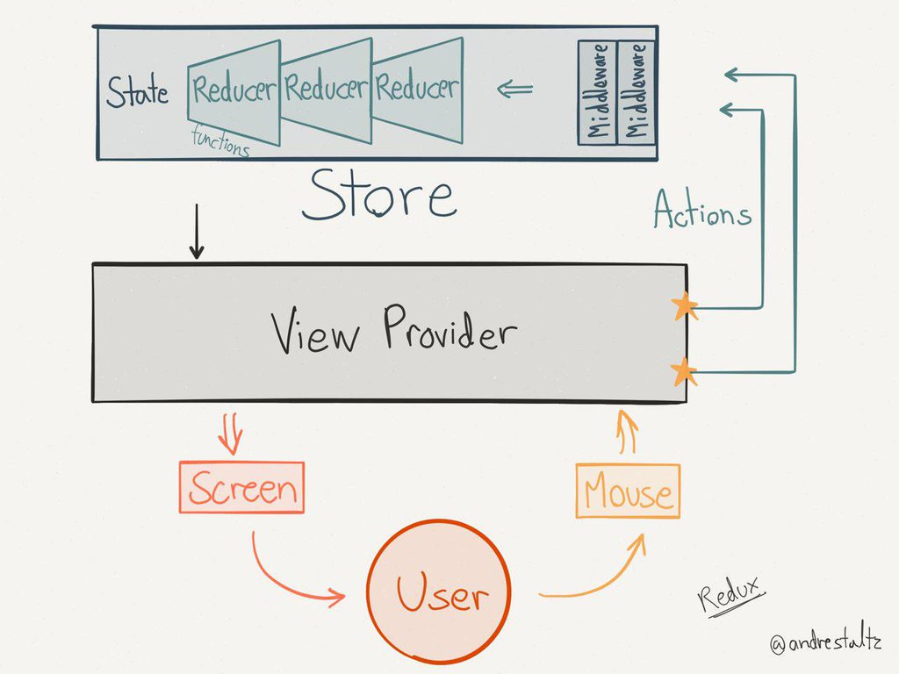
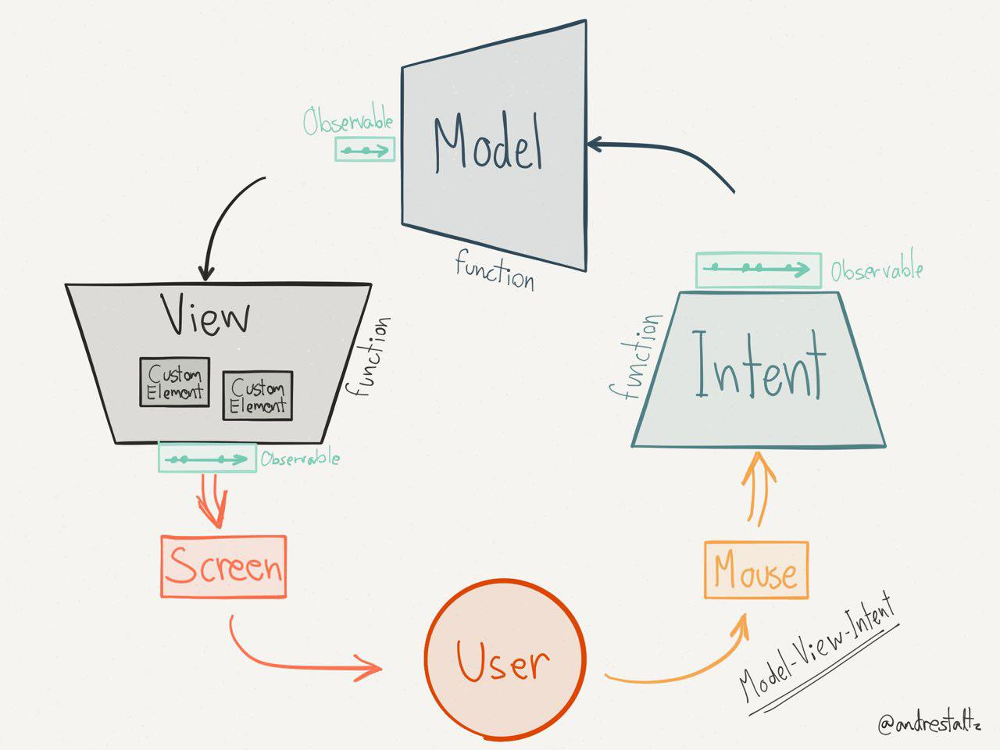

% Beyond flux. Going full cycle with FRP
% Clément Delafargue / [Clever Cloud](http://clever-cloud.com)
% 2015-10-16

--------------------------------------------------------------------------------

# I'm online!

 - [\@clementd](https://twitter.com/clementd) on twitter
 - [cltdl.fr/blog](http://cltdl.fr/blog)
 - [clever cloud](http://clever-cloud.com)


--------------------------------------------------------------------------------

## Complex frontend UIs

<details>
  Interactive UIs after page rendering
</details>

--------------------------------------------------------------------------------

## IHM à client semi-lourd


--------------------------------------------------------------------------------

## SPAs

<details>
  First render, then everything happens without page loads
</details>

--------------------------------------------------------------------------------


--------------------------------------------------------------------------------

## Two-way data binding

--------------------------------------------------------------------------------

<video src="/home/clement/Images/lol/nope.webm" loop></video>

--------------------------------------------------------------------------------


--------------------------------------------------------------------------------

## One-direction rendering loop

--------------------------------------------------------------------------------

## Flux

--------------------------------------------------------------------------------

## <big>Flux</big>

--------------------------------------------------------------------------------

## <big><big>Flux!</big></big>

--------------------------------------------------------------------------------

## <span class="red"><big><big>Flux!</big></big></span>

--------------------------------------------------------------------------------


## You can use React without flux

--------------------------------------------------------------------------------

## Do you really need it?

--------------------------------------------------------------------------------

## You don't need it

--------------------------------------------------------------------------------

## You *don't* need it

--------------------------------------------------------------------------------

## So you need it

--------------------------------------------------------------------------------


--------------------------------------------------------------------------------


--------------------------------------------------------------------------------


--------------------------------------------------------------------------------


--------------------------------------------------------------------------------

## Functional

--------------------------------------------------------------------------------

## ... ish

--------------------------------------------------------------------------------


--------------------------------------------------------------------------------

## Manual state management

--------------------------------------------------------------------------------

## Actions in views

--------------------------------------------------------------------------------

```javascript
render() {
  return (
    <button onclick={this.handleClick}>
      Click me
    </button>
  );
}
```

--------------------------------------------------------------------------------

```javascript
handleClick(e) {
    doStuff();
    this.setState(yolo);
}
```

--------------------------------------------------------------------------------

```javascript
handleClick(e) {
    doStuff();
    this.setState(yolo);
}
```

--------------------------------------------------------------------------------

```javascript
render() {
  return (
    <ChildComponent
       handlers={this.props.handlers} />
  );
}
```

```javascript
handleClick(e) {
    this.props.handleClick(e);
}
```

--------------------------------------------------------------------------------

## Nice architecture

--------------------------------------------------------------------------------

## Frustrating implementation

--------------------------------------------------------------------------------

## Redux

<details>
Simplification, more opinionated version of flux.<br>
3 base concepts
</details>


--------------------------------------------------------------------------------

## <span class="red">Single</span> source of truth

<details>
Only one store describing the whole application<br>
undo / redo
</details>

--------------------------------------------------------------------------------

## State is <span class="red">read-only</span>

<details>
No in-place mutation<br>
No race conditions<br>
Loggable / inspectable evolutions
</details>

--------------------------------------------------------------------------------

# Changes are made with <span class="red">pure</span> functions

<details>
No mutation, only transformations<br>
More composable
</details>

--------------------------------------------------------------------------------



--------------------------------------------------------------------------------

## Better

<details>
Easier to model and reason about than flux, but still a bit manual
</details>

--------------------------------------------------------------------------------

## Let's try with more suitable tools

<details>
Tools better suited to modeling evolutions
</details>

--------------------------------------------------------------------------------

## Reactive Programming

--------------------------------------------------------------------------------


--------------------------------------------------------------------------------

## Mind the hype

--------------------------------------------------------------------------------


--------------------------------------------------------------------------------


--------------------------------------------------------------------------------

## Inversion of Control

<details>
Describe transformations, let them be called when needed
</details>

--------------------------------------------------------------------------------

## Observer pattern

--------------------------------------------------------------------------------


--------------------------------------------------------------------------------

# Functional Reactive Programming

<details>
not really (don't tell Conal Elliott)
observable-based programming?
</details>

--------------------------------------------------------------------------------


--------------------------------------------------------------------------------

## No actions

--------------------------------------------------------------------------------

## No dispatchers

--------------------------------------------------------------------------------

## No Component Action Creation Factory

--------------------------------------------------------------------------------

## Only Observables


--------------------------------------------------------------------------------

## Observables

<details>
event streams
</details>

--------------------------------------------------------------------------------


--------------------------------------------------------------------------------

## Combinators

--------------------------------------------------------------------------------


<details>
lots of combination functions available
</details>


--------------------------------------------------------------------------------

## Redux + observables

--------------------------------------------------------------------------------

## Angular v2

<details>
Uses observables internally<br>
exposes observables in some parts of the public API (forms)
</details>

--------------------------------------------------------------------------------

## We can do better

<details>
Model all the application with observables
</details>

--------------------------------------------------------------------------------

## Cycle.js

--------------------------------------------------------------------------------


<details>
A UI is a cycle between a user and a computer
</details>


--------------------------------------------------------------------------------

```javascript
import Cycle from '@cycle/core';
import {makeDOMDriver} from '@cycle/dom';

function main(sources) {
  const input$ = f(sources.DOM);
  const vtree$ = g(input$);

  return {DOM: vtree$};
}

Cycle.run(main, {
  DOM: makeDOMDriver('#app')
});
```

--------------------------------------------------------------------------------

## MVI

--------------------------------------------------------------------------------


--------------------------------------------------------------------------------

## Intent

--------------------------------------------------------------------------------

```javascript
function intent(DOM) {
  return {
    changeWeight$:
      DOM
        .select('#weight')
        .events('input')
        .map(ev => ev.target.value),
    changeHeight$:
      DOM
        .select('#height')i
        .events('input')
        .map(ev => ev.target.value)
  };
}
```

--------------------------------------------------------------------------------

## Model

--------------------------------------------------------------------------------

```javascript
function model(actions) {
   return Observable.combineLatest(
    actions.changeWeight$.startWith(70),
    actions.changeHeight$.startWith(170),
     (weight, height) =>
       ({weight, height,
         bmi:
         calculateBMI(weight, height)})
   );
 }
```


--------------------------------------------------------------------------------

## View

--------------------------------------------------------------------------------

```javascript
function view(state$) {
  return state$
    .map(({weight, height, bmi}) =>
      div([
        renderWeightSlider(weight),
        renderHeightSlider(height),
        h2('BMI is ' + bmi)
      ])
  );
}
```

--------------------------------------------------------------------------------

```javascript
function main({DOM}) {
  return {
    DOM:
     view(model(intent(DOM)))
  };
}
```

--------------------------------------------------------------------------------



--------------------------------------------------------------------------------

## Purity


<details>
Pure functions everywhere<br>
Transformations from observables to observables
</details>

--------------------------------------------------------------------------------

## Drivers

<details>
Where effects happen<br>
Effects are described in a pure fashion<br>
Very easy to mock
</details>

--------------------------------------------------------------------------------

# Declarative effects

<div>
```javascript
  
  
  
  
const requests$ = Rx.Observable
 .interval(5000)
 .map(() => 'http://example.org/')
```
</div>

--------------------------------------------------------------------------------

# Easy mocking

<big>
```javascript
  
  
  
  
Cycle.run(main, {
  DOM:  myDomMock,
  HTTP: myHttpMock
});
```
</big>

--------------------------------------------------------------------------------

## tl;dl:

--------------------------------------------------------------------------------

# TIMTOWTDI

## <small>[Unidirectional UI architectures](http://staltz.com/unidirectional-user-interface-architectures.html)</small>

<details>
  RxJS only<br>
  Flux<br>
  RxJS + react<br>
  Redux<br>
  Elm
</details>

--------------------------------------------------------------------------------

## Play with Cycle.js

<details>Best way to get a feel of it</details>

--------------------------------------------------------------------------------

## Everything is moving fast

<details>
  Lots of ideas<br>
  No clear consensus (yet?)
</details>

--------------------------------------------------------------------------------

## Cycle diversity

<details>Generalize for any stream library</details>

--------------------------------------------------------------------------------

## xstream

<details>
  Simpler than RxJS<br>
  Forget about drivers<br>
  Hot observables by default
</details>

--------------------------------------------------------------------------------

## Elm: Farewell to FRP

--------------------------------------------------------------------------------


--------------------------------------------------------------------------------

## Read list

--------------------------------------------------------------------------------

# <small>[The Introduction to Reactive Programming you've been missing](https://gist.github.com/staltz/868e7e9bc2a7b8c1f754)</small>

--------------------------------------------------------------------------------

## <small><http://rxmarbles.com></small>

--------------------------------------------------------------------------------

## <http://cycle.js.org>

--------------------------------------------------------------------------------

# Thanks

## <http://cltdl.fr/gifs>

-------------------------------------------

# I'm online!

- [\@clementd](https://twitter.com/clementd) on twitter
- [cltdl.fr/blog](http://cltdl.fr/blog)
- [clever cloud](http://clever-cloud.com)

-------------------------------------------

# Images

 - [Cthulhu](http://douzen.deviantart.com/art/Cthulhu-332693947)
 - <http://cycle.js.org>
 - <http://rxmarbles.com>
