% Beyond flux. Going full cycle with FRP
% Clément Delafargue / [Clever Cloud](http://clever-cloud.com)
% 2015-10-16

--------------------------------------------------------------------------------

## DEATH TO MANUALLY MANAGED STATE

<video src="/home/clement/Images/lol/metal-worker.webm" loop></video>

--------------------------------------------------------------------------------

# I'm online!

 - [\@clementd](https://twitter.com/clementd) on twitter
 - [cltdl.fr/blog](http://cltdl.fr/blog)
 - [clever cloud](http://clever-cloud.com)


--------------------------------------------------------------------------------

## Complex frontend UIs

--------------------------------------------------------------------------------

## SPAs

--------------------------------------------------------------------------------

# Two-way data binding

<video src="/home/clement/Images/lol/nope.webm" loop></video>

--------------------------------------------------------------------------------


--------------------------------------------------------------------------------

## One-direction rendering loop

--------------------------------------------------------------------------------

## Flux

--------------------------------------------------------------------------------

## You can use React without flux

--------------------------------------------------------------------------------

## Do you really need it?

--------------------------------------------------------------------------------

## You don't need it

--------------------------------------------------------------------------------

## You *don't* need it

--------------------------------------------------------------------------------

## So you need it

--------------------------------------------------------------------------------

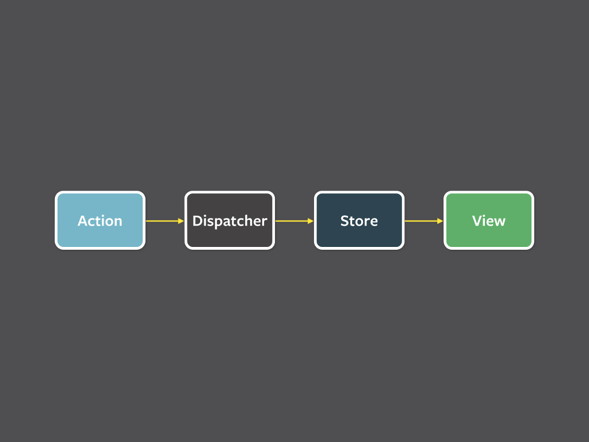

--------------------------------------------------------------------------------

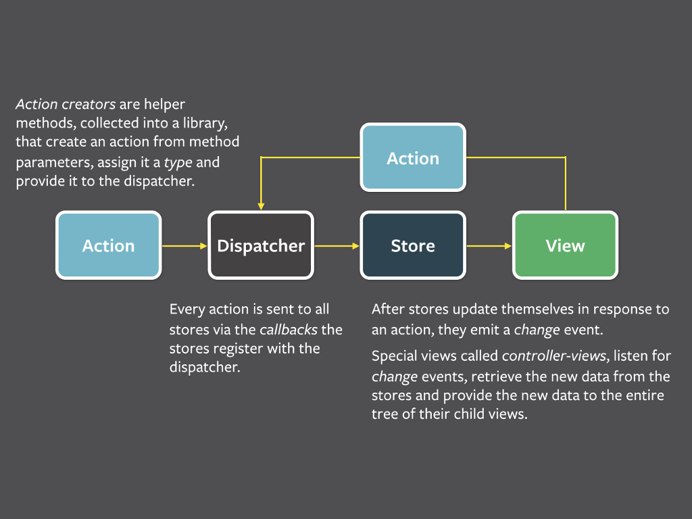

--------------------------------------------------------------------------------

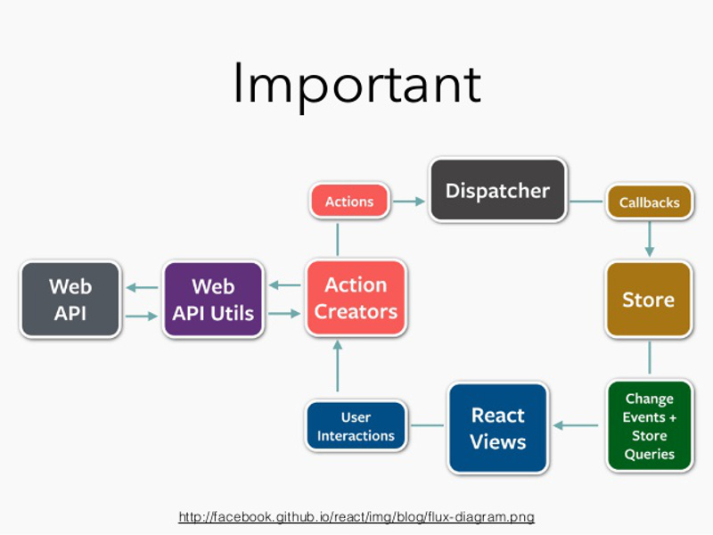

--------------------------------------------------------------------------------


--------------------------------------------------------------------------------

## Functional

--------------------------------------------------------------------------------

## ... ish

--------------------------------------------------------------------------------


--------------------------------------------------------------------------------

## Manual state management

--------------------------------------------------------------------------------

## Actions in views

--------------------------------------------------------------------------------

```javascript
render(e) {
  return (
    <button onclick={this.handleClick}>
      Click me
    </button>
  );
}
```

--------------------------------------------------------------------------------

```javascript
handleClick(e) {
    doStuff();
    this.setState(yolo);
}
```

--------------------------------------------------------------------------------

```javascript
handleClick(e) {
    doStuff();
    this.setState(yolo);
}
```

--------------------------------------------------------------------------------

```javascript
render() {
    return <ChildComponent handlers={this.props.handlers} />
}
```

```javascript
handleClick(e) {
    this.props.handleClick(e);
}
```

--------------------------------------------------------------------------------

## Nice architecture

--------------------------------------------------------------------------------

## Frustrating implementation

--------------------------------------------------------------------------------

## Let's try with more suitable tools

--------------------------------------------------------------------------------

## Reactive Programming

--------------------------------------------------------------------------------


--------------------------------------------------------------------------------

## Mind the hype

--------------------------------------------------------------------------------

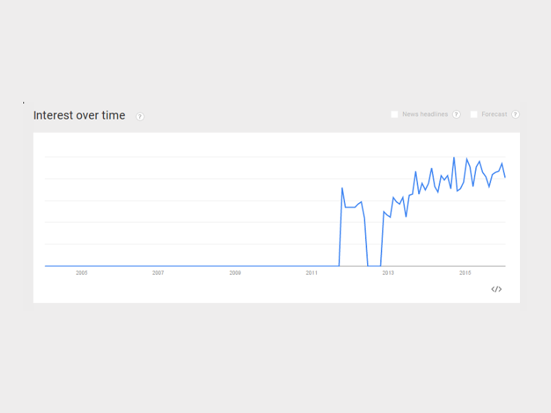

--------------------------------------------------------------------------------

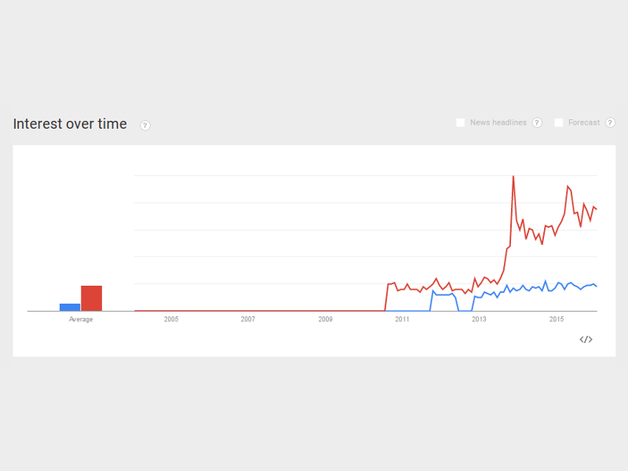

--------------------------------------------------------------------------------

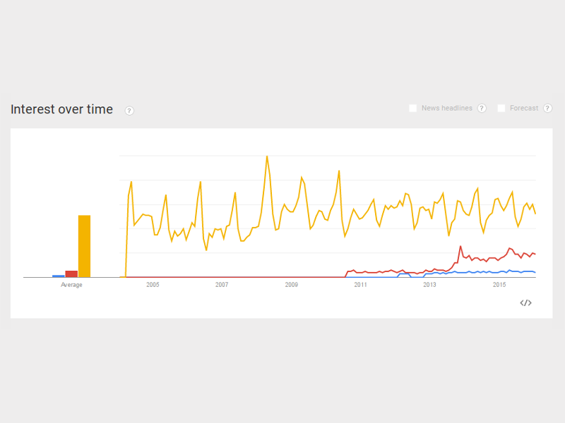

--------------------------------------------------------------------------------

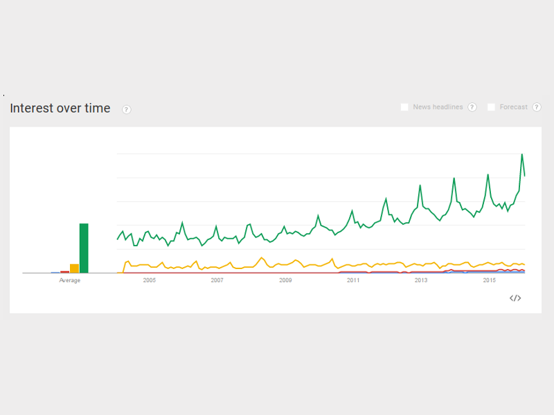

--------------------------------------------------------------------------------

## Inversion of Control

--------------------------------------------------------------------------------

## Observer pattern

--------------------------------------------------------------------------------

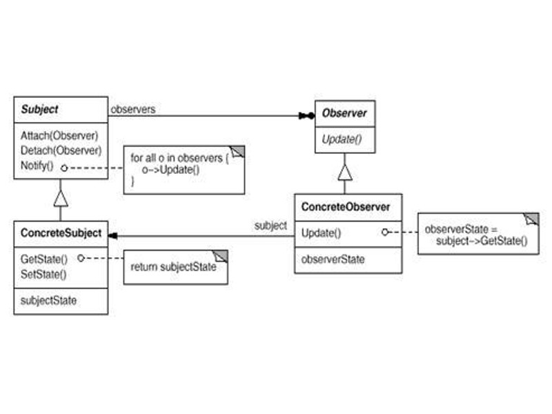

--------------------------------------------------------------------------------

# Functional Reactive Programming

--------------------------------------------------------------------------------

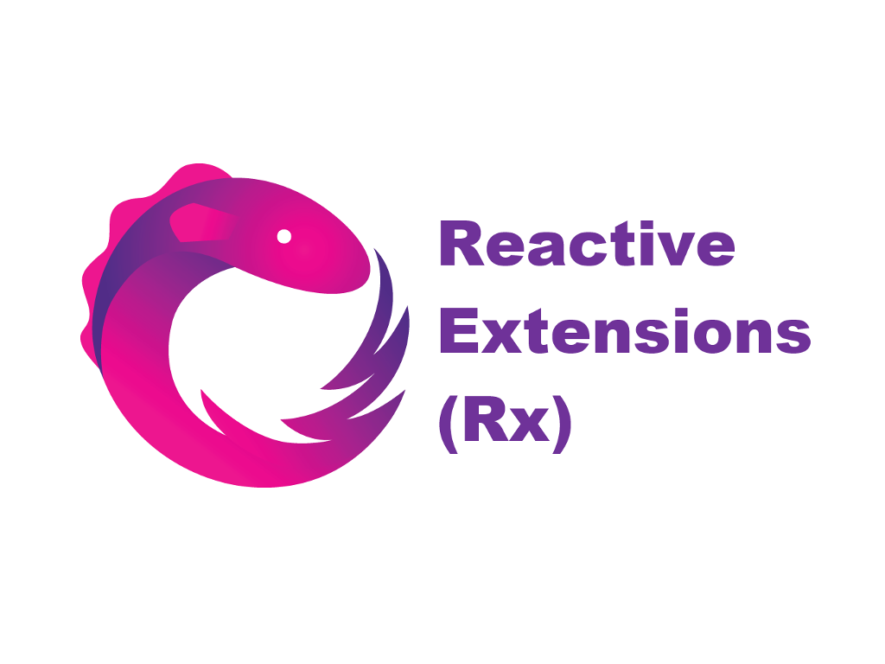

--------------------------------------------------------------------------------

## No actions

--------------------------------------------------------------------------------

## No dispatchers

--------------------------------------------------------------------------------

## No Component Action Creation Factory

--------------------------------------------------------------------------------

## Only Observables

--------------------------------------------------------------------------------


--------------------------------------------------------------------------------

## Observables

--------------------------------------------------------------------------------

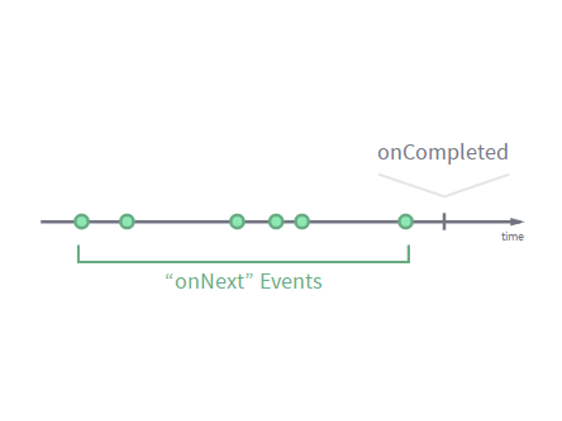

--------------------------------------------------------------------------------

## Combinators

--------------------------------------------------------------------------------

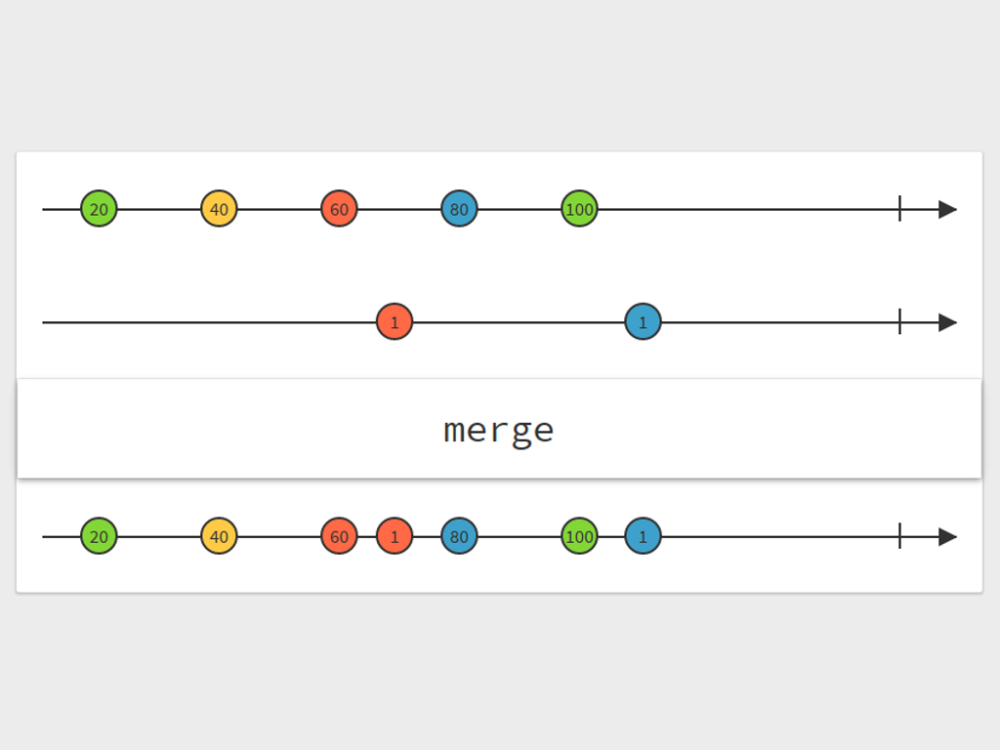

--------------------------------------------------------------------------------

## Cycle.js

--------------------------------------------------------------------------------

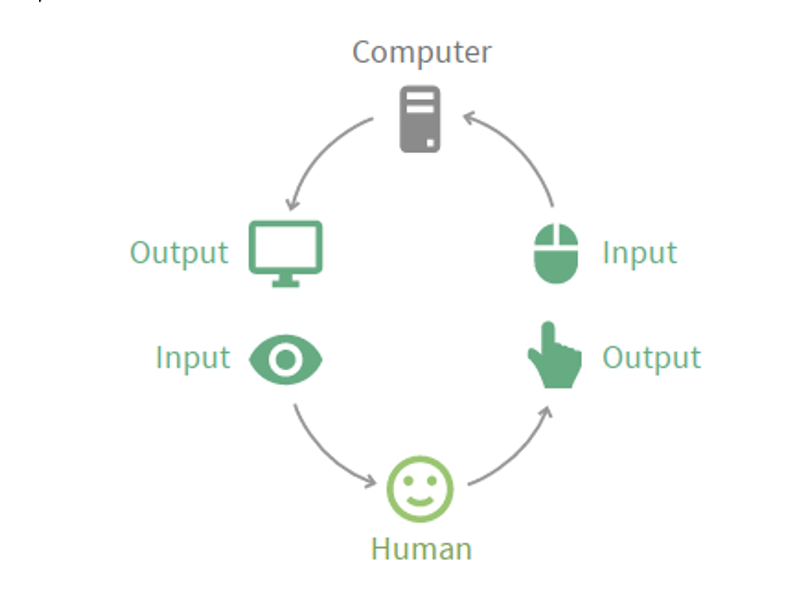

--------------------------------------------------------------------------------

```javascript
import Cycle from '@cycle/core';
import {makeDOMDriver} from '@cycle/dom';

function main(sources) {
  const input$ = f(sources.DOM);
  const vtree$ = g(input$);

  return {DOM: vtree$};
}

Cycle.run(main, {
  DOM: makeDOMDriver('#app')
});
```

--------------------------------------------------------------------------------

## MVI

--------------------------------------------------------------------------------

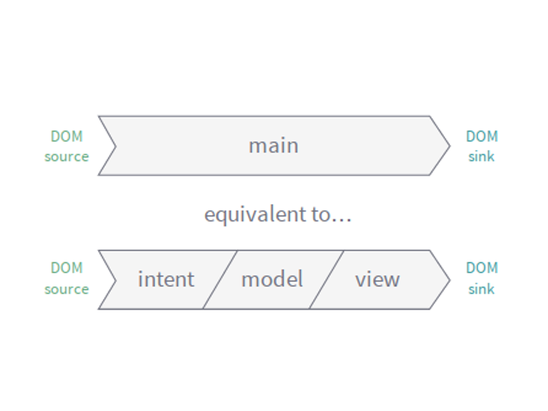

--------------------------------------------------------------------------------

## Intent

--------------------------------------------------------------------------------

```javascript
function intent(DOM) {
  return {
    changeWeight$
      DOM.select('#weight').events('input')
      .map(ev => ev.target.value),
    changeHeight$:
      DOM.select('#height').events('input')
      .map(ev => ev.target.value)
  };
}
```

--------------------------------------------------------------------------------

## Model

--------------------------------------------------------------------------------

```javascript
function model(actions) {
   return Observable.combineLatest(
    actions.changeWeight$.startWith(70),
    actions.changeHeight$.startWith(170),
     (weight, height) =>
       ({weight, height,
         bmi:
         calculateBMI(weight, height)})
   );
 }
```


--------------------------------------------------------------------------------

## View

--------------------------------------------------------------------------------

```javascript
function view(state$) {
  return state$.map(({weight, height, bmi}) =>
    div([
      renderWeightSlider(weight),
      renderHeightSlider(height),
      h2('BMI is ' + bmi)
    ])
  );
}
```

--------------------------------------------------------------------------------

```javascript
function main({DOM}) {
  return {
    DOM:
     view(model(intent(DOM)))
  };
}
```

--------------------------------------------------------------------------------

# <small>[The Introduction to Reactive Programming you've been missing](https://gist.github.com/staltz/868e7e9bc2a7b8c1f754)</small>

--------------------------------------------------------------------------------

## <small><http://rxmarbles.com></small>

--------------------------------------------------------------------------------

## <http://cycle.js.org>

--------------------------------------------------------------------------------

# Thanks

## <http://cltdl.fr/gifs>

-------------------------------------------

# I'm online!

- [\@clementd](https://twitter.com/clementd) on twitter
- [cltdl.fr/blog](http://cltdl.fr/blog)
- [clever cloud](http://clever-cloud.com)

-------------------------------------------

# Images

 - [Cthulhu](http://douzen.deviantart.com/art/Cthulhu-332693947)
 - <http://cycle.js.org>
 - <http://rxmarbles.com>
